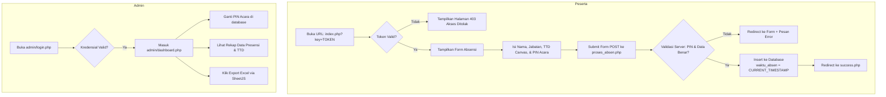

# Project Planning: Aplikasi Web Absensi Acara (Native PHP & MySQL)

Dokumen ini merupakan panduan spesifikasi dan arsitektur *high-level* untuk programmer dalam mengimplementasikan aplikasi web absensi acara berbasis web responsif, aman, dan mudah digunakan.

---

## 1. Ringkasan Proyek

- **Nama Proyek / Direktori**: `absen/` (dibuat di dalam root repository)
- **Teknologi Utama**:
  - Backend: **Native PHP** (PHP 7.4 / 8.x)
  - Database: **MySQL / MariaDB** (Koneksi via PDO / Prepared Statements)
  - Frontend: **HTML5, Vanilla CSS, & JavaScript**
- **Library Eksternal (CDN)**:
  - **Bootstrap 5** (CSS & JS Bundle): UI/UX modern, responsif, dan mobile-friendly.
  - **Signature Pad JS** (`szimek/signature_pad`): Input tanda tangan digital via touch screen / mouse pada HTML5 Canvas.
  - **SheetJS** (`xlsx.full.min.js`): Ekspor data rekap presensi ke file Excel (`.xlsx`) langsung di sisi client.

---

## 2. Struktur Database (Schema)

Gunakan satu database (contoh: `db_absen`) dengan 3 tabel utama:

### A. Tabel `pengaturan`
Menyimpan konfigurasi acara, token URL, dan PIN kehadiran.
- `id` (INT, Primary Key, Auto Increment)
- `nama_acara` (VARCHAR(150)) - Nama kegiatan / acara
- `access_token` (VARCHAR(64)) - Token rahasia pengaman akses URL form presensi (`?key=...`)
- `pin_acara` (VARCHAR(10)) - PIN aktif yang harus dimasukkan peserta saat absen
- `updated_at` (TIMESTAMP DEFAULT CURRENT_TIMESTAMP ON UPDATE CURRENT_TIMESTAMP)

### B. Tabel `admin`
Menyimpan data otentikasi administrator.
- `id` (INT, Primary Key, Auto Increment)
- `username` (VARCHAR(50), Unique)
- `password` (VARCHAR(255)) - Hash password menggunakan `password_hash()` PHP
- `nama_lengkap` (VARCHAR(100))
- `created_at` (TIMESTAMP DEFAULT CURRENT_TIMESTAMP)

### C. Tabel `presensi`
Menyimpan riwayat absensi peserta.
- `id` (INT, Primary Key, Auto Increment)
- `nama` (VARCHAR(100), Not Null) - Nama lengkap peserta
- `jabatan` (VARCHAR(100), Not Null) - Instansi / Organisasi / Jabatan
- `tanda_tangan` (MEDIUMTEXT, Not Null) - Data tanda tangan format Base64 PNG data URL (`data:image/png;base64,...`)
- `waktu_absen` (TIMESTAMP DEFAULT CURRENT_TIMESTAMP) - **Terkunci otomatis dari server/database**, tidak boleh menerima input waktu dari client
- `ip_address` (VARCHAR(45), Nullable) - IP perangkat peserta (opsional untuk audit)

---

## 3. Struktur Direktori & Rencana File

Struktur folder di dalam direktori `absen/`:

```text
absen/
├── config/
│   └── database.php          # Konfigurasi koneksi database (PDO) & helper umum
├── assets/
│   ├── css/
│   │   └── style.css         # Styling kustom (canvas tanda tangan, animasi kartu, responsive tweak)
│   └── js/
│       └── signature.js      # Inisialisasi Signature Pad, tombol clear, & konversi data ke input form
├── admin/
│   ├── auth_check.php        # Middleware verifikasi session login admin
│   ├── login.php             # Form login admin (username & password)
│   ├── logout.php            # Destruksi session dan redirect ke halaman login
│   ├── dashboard.php         # Tampilan rekap data absensi, statistik, & tombol export excel
│   └── update_pin.php        # Endpoint/handler update PIN acara & token keamanan
├── index.php                 # Halaman utama peserta: form absensi + canvas signature
├── proses_absen.php          # Backend handler validasi token, PIN, dan simpan presensi ke DB
├── success.php               # Halaman feedback sukses setelah submit kehadiran
└── database.sql              # Script DDL inisialisasi tabel dan akun admin default
```

---

## 4. Spesifikasi Per File & Modul

### 1. `config/database.php`
- Membuat koneksi database menggunakan **PDO** dengan mode error `ERRMODE_EXCEPTION`.
- Menyediakan fungsi utilitas sederhana (misal: query helper atau fungsi validasi sesi).

### 2. `index.php` (Halaman Presensi Peserta)
- **Validasi Token URL**:
  - Membaca parameter query `$_GET['key']`.
  - Mencocokkan nilai parameter dengan kolom `access_token` di tabel `pengaturan`.
  - Jika parameter tidak ada atau tidak cocok, tampilkan halaman status *403 Forbidden / Akses Ditolak* (mencegah form diakses publik tanpa izin).
- **Komponen Form**:
  - Input teks: **Nama Lengkap** & **Jabatan/Instansi**.
  - Canvas tanda tangan: Menggunakan tag `<canvas>` yang dihubungkan dengan library **Signature Pad**.
  - Tombol utilitas canvas: **Bersihkan Tanda Tangan (Clear)**.
  - Input teks / password: **PIN Acara** (diberitahukan panitia di lokasi).
  - Input hidden: Menampung data URL Base64 dari Signature Pad sebelum submit.
  - Hidden input atau query string untuk meneruskan `key` ke `proses_absen.php`.

### 3. `proses_absen.php` (Handler Simpan Presensi)
- Hanya menerima request dengan method `POST`.
- Validasi kembali parameter `key` ke tabel `pengaturan`.
- Validasi input `pin_acara`: Bandingkan PIN yang dikirimkan peserta dengan `pin_acara` aktif di database.
  - Jika PIN salah: Kembalikan peserta ke form dengan pesan flash error (*"PIN Acara tidak valid!"*).
- Validasi canvas tanda tangan: Pastikan canvas tidak kosong.
- Eksekusi query `INSERT INTO presensi` dengan prepared statement (Nama, Jabatan, Tanda Tangan Base64, dan IP Address). Kolom `waktu_absen` dibiarkan otomatis diisi oleh default `CURRENT_TIMESTAMP`.
- Redirect ke `success.php` setelah data berhasil tersimpan.

### 4. `success.php` (Halaman Konfirmasi)
- Menampilkan pesan terima kasih dan kartu konfirmasi kehadiran peserta.
- Tombol kembali atau tombol untuk melihat status presensi.

### 5. `admin/auth_check.php`
- Memastikan `session_start()` aktif.
- Memeriksa apakah session admin (`$_SESSION['admin_logged_in']`) sudah ada.
- Jika belum login, redirect langsung ke `admin/login.php`.

### 6. `admin/login.php`
- Form input `username` dan `password`.
- Validasi data POST ke tabel `admin` menggunakan fungsi bawaan PHP `password_verify()`.
- Jika berhasil, simpan info user ke session dan redirect ke `dashboard.php`.

### 7. `admin/dashboard.php`
- Memanggil `admin/auth_check.php`.
- Menampilkan ringkasan informasi:
  - Nama acara & PIN aktif saat ini.
  - URL presensi aktif lengkap dengan token (contoh: `https://domain.com/absen/index.php?key=XYZ123`) disertai tombol "Copy Link".
  - Kartu statistik (Total Kehadiran Hari Ini / Total Keseluruhan).
- **Fitur Ganti PIN**:
  - Modal atau form inline untuk memperbarui PIN Acara (memanggil `update_pin.php`).
- **Tabel Data Presensi**:
  - Kolom: No, Waktu Absen (Format Tanggal & Jam Server), Nama, Jabatan, Preview Tanda Tangan (gambar thumbnail modal/popover), dan Aksi (opsional: Hapus).
- **Fitur Ekspor Excel**:
  - Tombol "Export Excel" yang mengeksekusi script SheetJS (`XLSX.utils.table_to_book`).
  - Mengonversi data tabel presensi menjadi file `.xlsx` secara instan di browser admin tanpa membebani resource server.

### 8. `admin/update_pin.php`
- Menerima request POST dari admin (hanya jika session login valid).
- Memperbarui nilai `pin_acara` (dan opsi regenerate `access_token` jika panitia ingin mengganti tautan).
- Redirect kembali ke `dashboard.php` dengan pesan status sukses.

---

## 5. Alur Kerja Sistem (Workflow)



---

## 6. Standar Keamanan & Best Practices

1. **Pencegahan SQL Injection**:
   - Wajib menggunakan **PDO Prepared Statements** dengan placeholder parameter (`:param` atau `?`) pada seluruh query yang melibatkan input dari user.
2. **Pencegahan Cross-Site Scripting (XSS)**:
   - Gunakan `htmlspecialchars($data, ENT_QUOTES, 'UTF-8')` saat merender input peserta (nama, jabatan) di halaman tabel admin.
3. **Integritas Waktu Server**:
   - Kolom `waktu_absen` tidak boleh diambil dari waktu jam HP / perangkat klien (`Date()` JS), melainkan murni dari `CURRENT_TIMESTAMP` di database MySQL atau fungsi `date('Y-m-d H:i:s')` server PHP.
4. **Keamanan Password**:
   - Password admin wajib disimpan dalam bentuk hash menggunakan `password_hash($password, PASSWORD_BCRYPT)`.
5. **Sanitasi Data Tanda Tangan**:
   - Pastikan data URL Base64 yang dikirimkan diawali dengan prefix `data:image/png;base64,` sebelum disimpan.

---

## 7. Checklist Tahapan Implementasi untuk Programmer

- [ ] **Fase 1: Persiapan Lingkungan & Database**
  - [ ] Buat folder project `absen/`.
  - [ ] Buat file `database.sql` dan eksekusi pada MySQL/phpMyAdmin.
  - [ ] Konfigurasi file `config/database.php` (host, user, password, dbname).
  - [ ] Buat akun admin default (dengan password ter-hash).
- [ ] **Fase 2: Frontend & Validasi Peserta**
  - [ ] Buat layout `index.php` berbasis Bootstrap 5.
  - [ ] Integrasikan `signature_pad.umd.min.js` dari CDN pada elemen canvas.
  - [ ] Implementasikan pengecekan parameter URL `?key=...`.
  - [ ] Buat handler `proses_absen.php` dan halaman `success.php`.
- [ ] **Fase 3: Panel Administrator**
  - [ ] Buat `admin/login.php`, `admin/logout.php`, dan `admin/auth_check.php`.
  - [ ] Buat `admin/dashboard.php` untuk menampilkan daftar kehadiran secara rapi.
  - [ ] Buat fitur modal dan file `admin/update_pin.php` untuk mengganti PIN kehadiran.
  - [ ] Integrasikan `xlsx.full.min.js` untuk fitur tombol ekspor data tabel presensi ke Excel.
- [ ] **Fase 4: Testing & Finishing**
  - [ ] Uji coba input absensi melalui perangkat mobile / simulasi sentuhan jari pada canvas.
  - [ ] Uji coba proteksi URL token (akses tanpa parameter key vs dengan key yang benar).
  - [ ] Uji coba input PIN yang salah vs PIN yang benar.
  - [ ] Verifikasi timestamp yang tersimpan sesuai dengan zona waktu server (atur `date_default_timezone_set('Asia/Jakarta')` pada config).
